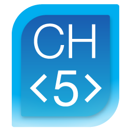

# ch5-join-getter

    

---

---

A simple proof of concept. Dynamically get all the latest CH5 join data from the CH5 json file at [https://siproducts.blob.core.windows.net/ch5-release/rjviewapp.json](https://siproducts.blob.core.windows.net/ch5-release/rjviewapp.json).

<!-- START doctoc generated TOC please keep comment here to allow auto update -->
<!-- DON'T EDIT THIS SECTION, INSTEAD RE-RUN doctoc TO UPDATE -->

## Contents 📖

-   [Team :soccer:](#team-soccer)
-   [Contributors :sparkles:](#contributors-sparkles)
-   [LICENSE :balance_scale:](#license-balance_scale)

<!-- END doctoc generated TOC please keep comment here to allow auto update -->

## Team :soccer:

This project is maintained by the following person(s) and a bunch of [awesome contributors](https://github.com/Norgate-AV/ch5-join-getter/graphs/contributors).

<table>
  <tr>
    <td align="center"><a href="https://github.com/damienbutt"> <b>Damien Butt</b></a> </td>
  </tr>
</table>

## Contributors :sparkles:

<!-- ALL-CONTRIBUTORS-BADGE:START - Do not remove or modify this section -->

<!-- ALL-CONTRIBUTORS-BADGE:END -->

Thanks go to these awesome people ([emoji key](https://allcontributors.org/docs/en/emoji-key)):

<!-- ALL-CONTRIBUTORS-LIST:START - Do not remove or modify this section -->
<!-- prettier-ignore-start -->
<!-- markdownlint-disable -->

<!-- markdownlint-restore -->
<!-- prettier-ignore-end -->

<!-- ALL-CONTRIBUTORS-LIST:END -->

This project follows the [all-contributors](https://allcontributors.org) specification.
Contributions of any kind are welcome!

## LICENSE :balance_scale:

[MIT](LICENSE)
